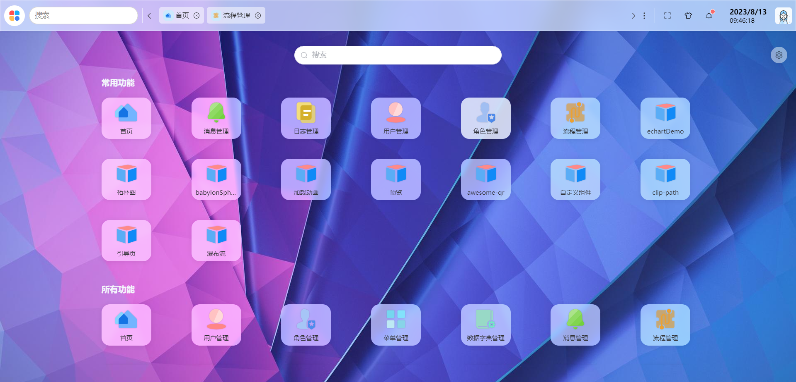
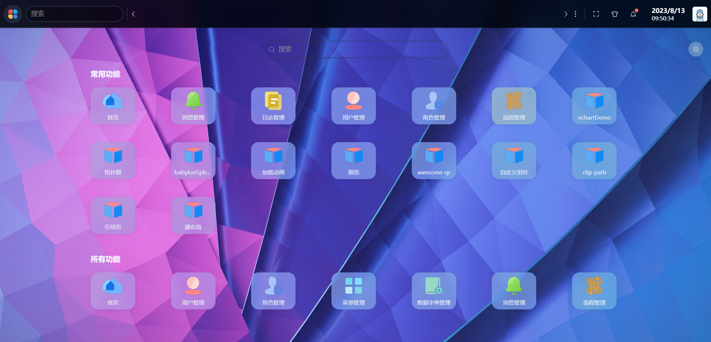
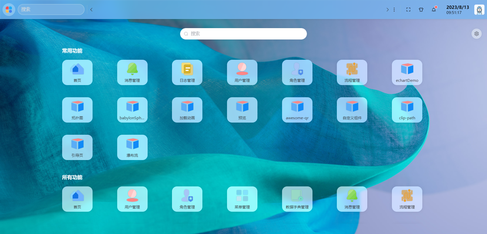

# hippo-pro
欢迎使用河码桌面，河码桌面是一个基于vue3+vite+element pro + pnpm 创建的monorepo项目，项目采用的是类操作系统的web界面，操作起来简单又方便，符合用户习惯，又没有操作系统的复杂！

## 页面
<br/>
<br/>
<br/>
<br/>
<br/>
<br/>
<br/>
<br/>
<br/>
<br/>
<br/>
<br/>
<br/>
<br/>
<br/>
<br/>

## 初始化

```sh
pnpm install
```

### 启动

```sh
pnpm start 
```

### 打包

```sh
pnpm run build
```
